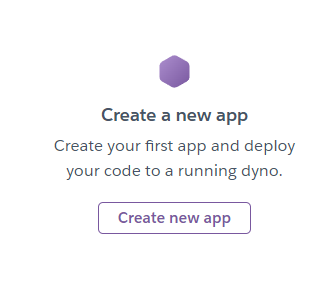
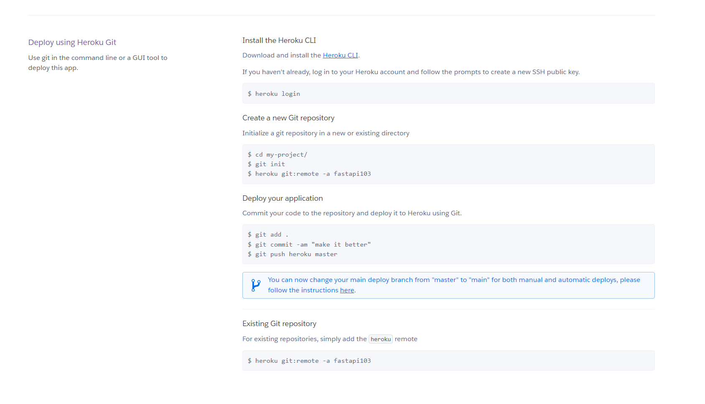
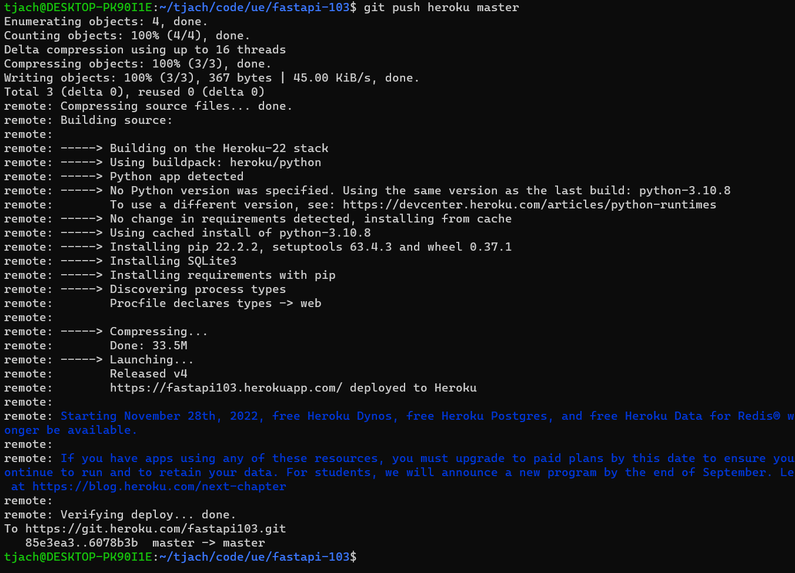
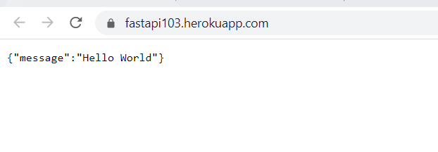
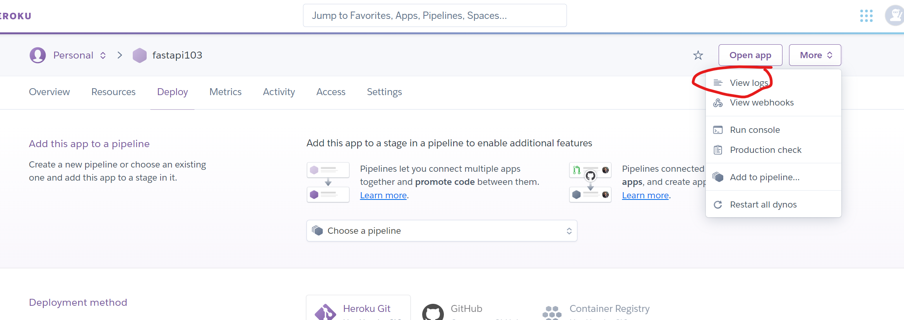

## Prosta aplikacja

1. Stwórz konto na https://signup.heroku.com/
2. Aplikacje/kontenery nazywają się tutaj "dynos". Więc na początku trzeba stworzyć nową aplikację:

3. Potem robimy wszystko jak po sznurku:

4. Należy pamiętać o pliku requirements.txt, a całość wysyłamy za pomocą GITa:
``` 
git push heroku master
```
5. Aby Heroku wiedział co ma zrobić, należy przygotować tzw. Procfile. Jest to plik wskazujący co i jak należy uruchomić:
```
web: uvicorn main:app --host=0.0.0.0 --port=${PORT:-5000}
```
6. Po pushu wszystko działa:


7. Z racji tego, że Heroku jest darmowe, to nasza applikacja zostanie ubita po jakimś czasie nieaktywności. Da się to obejść: 
https://towardsdatascience.com/how-to-deploy-your-fastapi-app-on-heroku-for-free-8d4271a4ab9

## Aplikacja z OpenCV
Zdeployujemy prostą aplikację z OpenCV. Taką, która wyświetla złączenie dwóch obrazków wraz z tekstem pobranym od użytkownika.

1. Zmieniam plik `requirements.txt`, dodaję opencv w wersji headless:
`opencv-python-headless==4.5.5.62`
2. 
W tym celu do `main.py` dokładam sekcję:
``` 
@app.get("/opencv/{name}")
async def say_hello(name: str):
    circle = cv2.imread('img/circle.png')
    circle = cv2.cvtColor(circle, cv2.COLOR_BGR2GRAY)
    star = cv2.imread('img/star.png')
    star = cv2.cvtColor(star, cv2.COLOR_BGR2GRAY)
    combined = cv2.subtract(star, circle)
    cv2.putText(img=combined, text=f'Hello {name}',
                org=(50, 100), fontFace=cv2.FONT_HERSHEY_TRIPLEX, fontScale=2,
                color=(255, 255, 255), thickness=3)

    is_success, im_png = cv2.imencode(".png", combined)
    return StreamingResponse(io.BytesIO(im_png.tobytes()), media_type="image/png")
```
3. Re-deploy i sprawdzamy:
```
git push heroku heroku-master:master
heroku ps:scale web=1
```

4. Po zdeployowaniu na heroku niestety działać nie będzie. Podglądamy logi aplikacji:
 
``` 

```