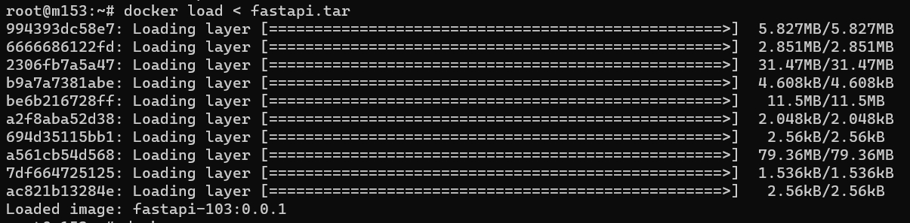

1. Dla przykładu, będziemy korzystać z serwera https://mikr.us/
2. Pierwsza rzecz, to kupienie konta. Potrzebna nam co najmniej wersja 2.1.
3. Po zakupie, w dobrym tonie jest zmienić hasło i dodać swój klucz SSH jako sposób do logowania. I zrobić dodatkowe rzeczy wyszczególnione w mailu powitalnym.
4. Logujemy się przez SSH na serwer i sprawdzamy katalog `noobs`:

5. Chcemy Dockera (przy okazji warto zerknąć na resztę rzeczy), więc uruchamiamy skrypt `chche_dockera.sh`.
6. W międzyczasie, w panelu Mikrusa musimy sprawdzić jakie mamy otwarte porty i jakim adresem możemy się dodać do naszej aplikacji:

7W międzyczasie, instalujemy Dockera na naszej maszynie lokalnej i tworzymy Dockerfile naszego rozwiązania. Pamiętaj o podmianie portów na ten z mikrusa:
``` 
 FROM python:3.10-alpine
WORKDIR /code

COPY ./requirements.txt /code/requirements.txt
RUN pip install -r requirements.txt

RUN set PYTHONPATH=.
COPY main.py /code

EXPOSE 20153
ENTRYPOINT ["uvicorn"]
CMD ["main:app", "--host", "0.0.0.0", "--port", "20153"]
```
7. Budujemy obraz dockerowy: 
``` 
docker build . -t fastapi-103:0.0.1
```

7. Sprawdzamy, czy wszystko działa lokalnie:
``` 
docker run -20153:20153 fastapi-103:0.0.1
```
 
8. Jak działa, to trzeba teraz jakoś przekazać obraz do dockera na mikrusie. Najlepsze rozwiązanie, to użycie jakiegoś rejestruk kontenerów (np. https://hub.docker.com/), ale to zadanie trudniejsze niż po prostu spakowanie naszego konenera i wysłanie do mikrusa:
``` 
docker save fastapi-103:0.0.1 -o fastapi.tar
scp -P 10153 fastapi.tar root@srv16.mikr.us:~
```
9. Na serwerze mikrusa ładujemy obraz dockerowy:

10. I go uruchamiamy (dla dociekliwych, najlepiej korzystając z tmuxa/screena):

